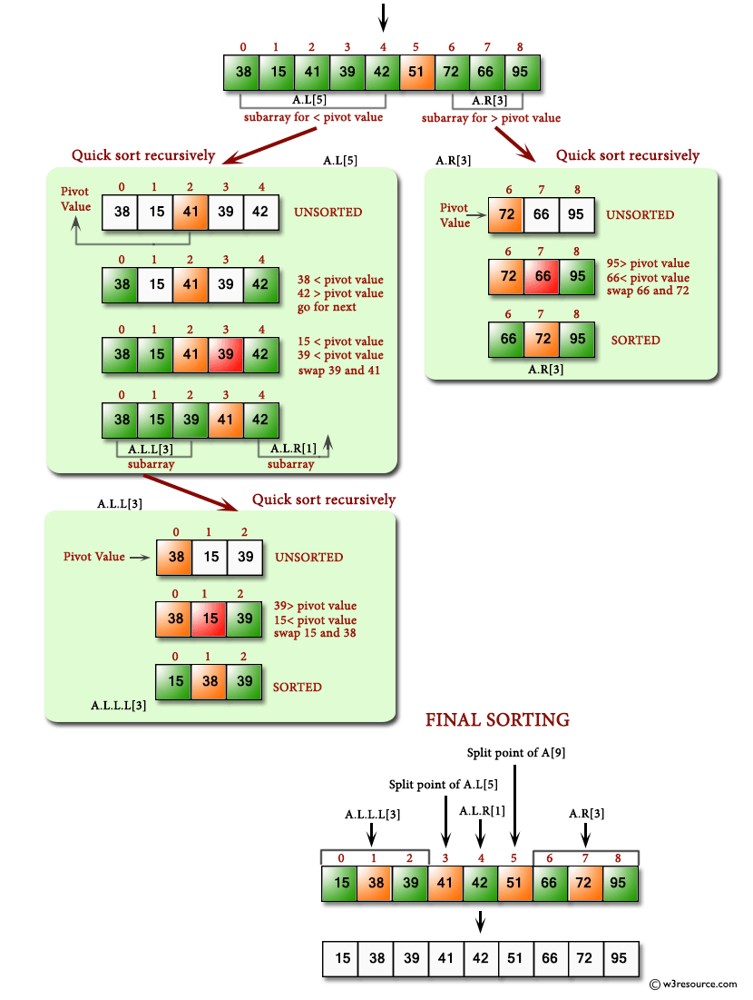

# C# Sharp Searching and Sorting Algorithm

## QuickSort
An algorithm challenge to practice QuckSort: an efficient sorting algorithm, serving as a systematic method for placing the elements of an array. 

### Techquniques
Sort, Partition, Pivot 

### About me
By Rouz Majlessi
[About Me](https://rouz1130.github.io/PortfolioS//) 

May 21, 2018

### Resources
You can find the practice material from the resources link below
[Resources](https://www.w3resource.com/csharp-exercises/searching-and-sorting-algorithm/searching-and-sorting-algorithm-exercise-9.php) - Links to all resources.  
